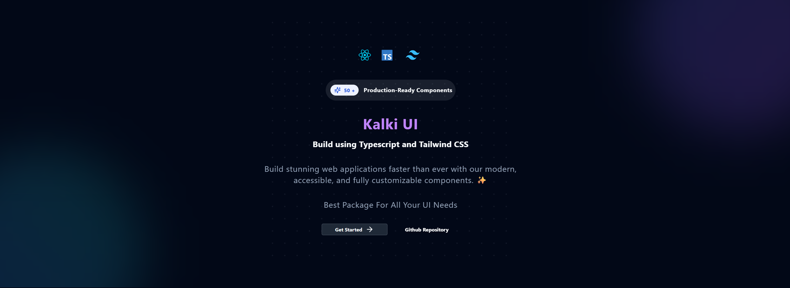

# [Kalki UI](https://kalki-ui.vercel.app/)

[Kalki UI](https://kalki-ui.vercel.app/) is a modern React component library built with TypeScript and styled using Tailwind CSS. Designed for performance and developer efficiency, it offers a clean and scalable set of UI components to accelerate React application development.



<div align="center">
  
  
  
</div>

### Built With:

<div align="center">

  
  
  
  
  
  
  
  
  

</div>

---

## Overview

**[Kalki UI](https://kalki-ui.vercel.app/)** is a powerful React-based UI component library designed to streamline the development of modern web applications, combining flexibility, performance, and accessibility.

### Why Kalki-UI?

This project empowers developers to create stunning user interfaces effortlessly. The core features include:

- 🎨 **Tailwind CSS Integration**  
  Simplifies styling with a utility-first approach for rapid UI development.

- 🧩 **Modular Component Architecture**  
  Promotes reusability and maintainability with easy integration and customization.

- 📜 **TypeScript Support**  
  Enhances code quality and developer experience via strict type-checking and IntelliSense.

- 📱 **Responsive Design**  
  Ensures consistent user experience across all devices.

- ♿ **Accessibility Features**  
  Components are designed to be accessible for all users.

- ⚙️ **Customizable Components**  
  Offers a wide range of components that can be tailored to specific design needs.

---

## Installation

```sh
npm install kalki-ui
# or
yarn add kalki-ui
# or 
pnpm add kalki-ui
```

## Usage

```jsx
import { Button } from 'kalki-ui';
import 'kalki-ui/dist/index.css';
```

## Development

1. Clone the repository
2. Install dependencies
3. Start development server
4. Build the library

## Scripts

- `dev` - Start development mode with watch
- `build` - Build the library for production
- `clean` - Remove build artifacts
- `lint` - Run ESLint checks
- `lint:fix` - Fix ESLint issues
- `format` - Format code with Prettier
- `typecheck` - Run TypeScript type checks
- `pre` - Start Vite development server
- `pre:build` - Build with Vite

## Tech Stack

- React
- TypeScript
- Tailwind CSS
- Rollup
- Vite
- ESLint
- Prettier
- Babel

## License

MIT © Ravi Teja
