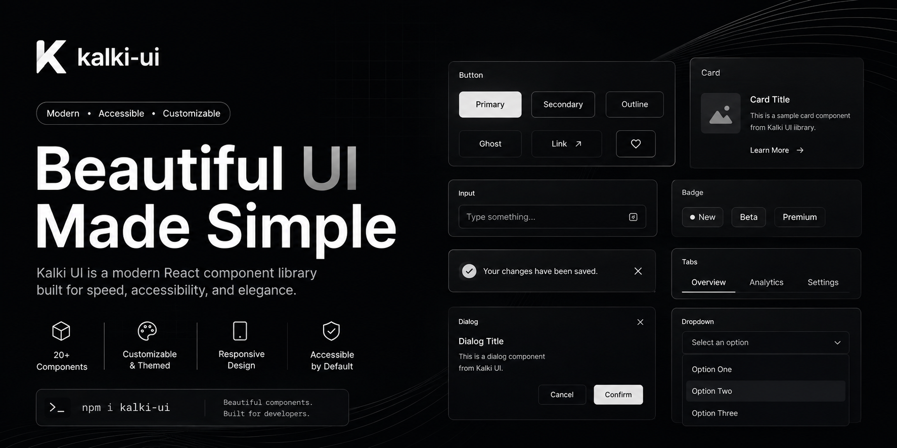

# [Kalki UI](https://kalki-ui.vercel.app/)

[Kalki UI](https://kalki-ui.vercel.app/) is a modern React component library built with TypeScript and styled using Tailwind CSS. Designed for performance and developer efficiency, it offers a clean and scalable set of UI components to accelerate React application development.



<div align="center">
  
  
  
</div>

### Built With:

<div align="center">

  
  
  
  
  
  
  
  
  

</div>

---

## Overview

**[Kalki UI](https://kalki-ui.vercel.app/)** is a powerful React-based UI component library designed to streamline the development of modern web applications, combining flexibility, performance, and accessibility.

### Why Kalki-UI?

This project empowers developers to create stunning user interfaces effortlessly. The core features include:

- 🎨 **Tailwind CSS Integration**  
  Simplifies styling with a utility-first approach for rapid UI development.

- 🧩 **Modular Component Architecture**  
  Promotes reusability and maintainability with easy integration and customization.

- 📜 **TypeScript Support**  
  Enhances code quality and developer experience via strict type-checking and IntelliSense.

- 📱 **Responsive Design**  
  Ensures consistent user experience across all devices.

- ♿ **Accessibility Features**  
  Components are designed to be accessible for all users.

- ⚙️ **Customizable Components**  
  Offers a wide range of components that can be tailored to specific design needs.

---

## Components

### Layout & Structure

| Component | Description |
| --- | --- |
| `Box` | Flexible layout container |
| `Div` | Styled div primitive with variants |
| `Stack` / `StackItem` | Flexbox stack layout |
| `Splitter` / `SplitterPane` | Resizable split panes |
| `Separator` | Visual divider |
| `DotSeparator` | Dot-style separator |
| `SectionHeader` | Section title and subtitle |

### Navigation

| Component | Description |
| --- | --- |
| `Breadcrumb` / `BreadcrumbItem` | Hierarchical navigation trail |
| `Link` | Styled anchor link |
| `LinkBar` | Horizontal link navigation bar |
| `LinkButton` | Link styled as a button |
| `Tabs` / `Tab` | Tabbed content navigation |
| `ScrollToTop` | Scroll-to-top floating button |

### Actions & Feedback

| Component | Description |
| --- | --- |
| `Button` / `ButtonIcon` / `ButtonText` | Primary action button |
| `CloseButton` | Dismiss / close control |
| `Toggle` / `ToggleGroup` | Toggle and toggle group controls |
| `Alert` | Alert with header, body, and footer |
| `Banner` | Promotional or status banner |
| `Badge` | Status or count badge |
| `Tag` | Removable labeled tag |
| `Spinner` | Loading spinner |
| `Skeleton` | Placeholder loading state |
| `Ripple` | Ripple interaction effect |
| `Empty` | Empty state with media and content |
| `ErrorPage` | Error / fallback page |

### Content & Media

| Component | Description |
| --- | --- |
| `Accordion` | Expandable content panels |
| `Card` | Content card with header, body, and footer |
| `Modal` | Dialog overlay |
| `Drawer` | Side panel overlay |
| `Carousel` | Image / content carousel |
| `TextCarousel` | Rotating text carousel |
| `Image` | Optimized image with object-fit options |
| `GalleryImage` | Gallery image display |
| `Figure` / `FigureImage` / `FigureCaption` | Figure with caption |
| `Avatar` / `AvatarImage` / `AvatarFallback` | User avatar |
| `FullScreenToggle` | Fullscreen mode toggle |
| `ContentScrollable` | Scrollable content area |

### Typography & Text

| Component | Description |
| --- | --- |
| `Heading` | Semantic heading |
| `Paragraph` | Paragraph text |
| `Text` | Inline / body text |
| `Code` | Inline or block code |
| `Highlighter` | Text highlight utility |
| `TextHighlighter` | Emphasis / highlight text styles |
| `JsonViewer` | JSON data viewer |

### Data Display

| Component | Description |
| --- | --- |
| `Table` / `TableHead` / `TableBody` / `TableRow` / `TableCell` / `TableFooter` | Data table |
| `TableList` | List-style table layout |
| `ListGroups` / `ListGroupItem` | Grouped list items |
| `OrderedList` / `OrderedListItem` | Ordered list |
| `UnOrderedList` / `UnOrderedListItem` | Unordered list |

---

## Installation

```sh
npm install kalki-ui
# or
yarn add kalki-ui
# or
pnpm add kalki-ui
```

**Peer dependencies:** `react`, `react-dom`, and `tailwindcss`.

## Usage

Import only the components you need (recommended). Each component is a separate entry so unused code stays out of your bundle:

```jsx
import { Button } from 'kalki-ui/button';
import { Alert } from 'kalki-ui/alert';
import { Card } from 'kalki-ui/card';
import 'kalki-ui/styles.css';

function App() {
  return (
    <Card>
      <Alert>
        <Button>Get started</Button>
      </Alert>
    </Card>
  );
}
```

You can still import from the root package if you prefer:

```jsx
import { Button, Alert, Card } from 'kalki-ui';
import 'kalki-ui/styles.css';
```

### Available deep imports

Use `kalki-ui/<name>` for any component, for example:

`accordion`, `alert`, `avatar`, `badge`, `banner`, `box`, `breadcrumb`, `button`, `card`, `carousel`, `close-button`, `code`, `content-scrollable`, `div`, `dot-separator`, `drawer`, `empty`, `error-page`, `figure`, `full-screen-toggle`, `gallery`, `heading`, `highlighter`, `image`, `json-viewer`, `link`, `link-bar`, `link-button`, `list-groups`, `modal`, `ordered-list`, `paragraph`, `ripple`, `scroll-to-top`, `section-header`, `separator`, `skeleton`, `spinner`, `splitter`, `stack`, `table`, `table-list`, `tabs`, `tag`, `text`, `text-carousel`, `text-highlighter`, `toggle`, `typography`, `unordered-list`

## Development

1. Clone the repository
2. Install dependencies with `npm install`
3. Start the Vite development server with `npm run dev`
4. Build the library with `npm run build`

## Scripts

| Script | Description |
| --- | --- |
| `dev` | Start Vite development server |
| `build` | Generate entries, clean, and build the library with Vite |
| `generate:entries` | Generate per-component entry files and package exports |
| `clean` | Remove build artifacts |
| `lint` | Run ESLint checks |
| `lint:fix` | Fix ESLint issues |
| `format` | Format code with Prettier |
| `typecheck` | Run TypeScript type checks |

## Tech Stack

- React
- TypeScript
- Tailwind CSS
- Vite
- ESLint
- Prettier

## License

MIT © Ravi Teja
